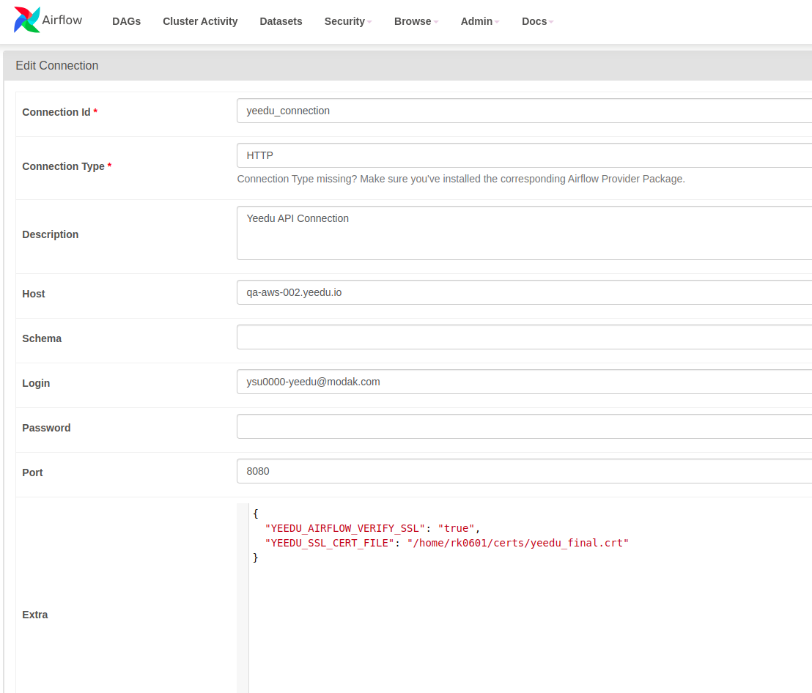
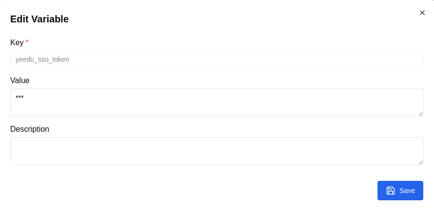

# Airflow Yeedu Operator
[](https://badge.fury.io/py/airflow-yeedu-operator)

> **Note:** This version of `airflow-yeedu-operator` is compatible only with **Apache Airflow 2.x**. Apache Airflow 3.x is **not supported**.

---

## Installation

To install the Yeedu Operator in your Airflow environment, run:

```bash
pip3 install airflow-yeedu-operator
```

---

## Overview

The `YeeduOperator` enables Airflow users to submit and monitor Spark jobs and notebooks in **Yeedu**. It provides a smooth interface to:

- Submit notebooks and jobs to Yeedu
- Monitor job progress and completion
- Handle failures and capture logs in Airflow UI

---

## Prerequisites

- Apache Airflow 2.x environment
- Valid credentials to interact with the Yeedu API.
- Yeedu Authentication (LDAP, AAD, or SSO)
- Valid certificate for SSL if applicable

---

## Airflow Connection Setup

### Step 1: Create Airflow Connection

1. In the Airflow UI, go to **Admin > Connections**
2. Click the **+ Add Connection** button to create a new connection

Fill in the following fields:

| Field        | Value / Example                       |
|--------------|----------------------------------------|
| Conn Id      | `yeedu_connection`                    |
| Conn Type    | `HTTP`                                |
| Login        | Your LDAP/AAD username (if applicable)|
| Password     | Your password (if applicable)         |
| Extra        | JSON with SSL options (see below)     |

### Extra JSON Field

```json
{
    "YEEDU_AIRFLOW_VERIFY_SSL": "true",
    "YEEDU_SSL_CERT_FILE": "/path/to/cert/file"
}
```

> Replace `/path/to/cert/file` with the actual path to your certificate file.

---

## SSO Token Setup (Only for SSO auth)

If your Yeedu authentication method is **SSO**, follow these steps:

1. Go to **Admin > Variables**
2. Click **+ Add Variable**
3. Enter:
   - **Key**: e.g., `yeedu_sso_token`
   - **Value**: your Yeedu login token

You will refer to this variable in your DAG using `token_variable_name`.

---

## Example DAG

### DAG Definition

```python
from datetime import datetime, timedelta
from airflow import DAG
from yeedu.operators.yeedu import YeeduOperator

default_args = {
    'owner': 'airflow',
    'depends_on_past': False,
    'start_date': datetime(2023, 1, 1),
    'retries': 1,
    'retry_delay': timedelta(minutes=5),
}

dag = DAG(
    'yeedu_job_execution',
    default_args=default_args,
    description='DAG to execute jobs using Yeedu API',
    schedule_interval='@once',
    catchup=False,
)
```

---

## Task Configuration

### LDAP / AAD Authentication

Use `Login` and `Password` in the Airflow connection:

```python
submit_job_task = YeeduOperator(
    task_id='LDAP_TASK',
    job_url='https://hostname:{restapi_port}/tenant/tenant_id/workspace/workspace_id/spark/notebook/notebook_id', 
    #Replace with your Job/Notebook Url
    connection_id='yeedu_connection', # Replace with your Connection Id
    dag=dag,
)
```

> Copy the Job/Notebook URL from the Yeedu UI and replace the port in the URL with the actual `restapi_port` value before using it in the DAG.

---

### SSO Authentication

Use a token stored in Airflow Variables:

```python
submit_job_task = YeeduOperator(
    task_id='SSO_TASK',
    job_url='https://hostname:{restapi_port}/tenant/tenant_id/workspace/workspace_id/spark/notebook/notebook_id', 
    #Replace with your Job/Notebook Url
    connection_id='yeedu_connection',
    token_variable_name='yeedu_sso_token',  # Replace with your variable key
    dag=dag,
)
```

> You must skip `Login` and `Password` in the Airflow connection for SSO.

---

## Execution Steps

1. Save your DAG file in the `dags/` folder of your Airflow installation.
2. Ensure the connection and (if needed) token variable are configured correctly.
3. Trigger the DAG manually or let it run on the scheduled interval.
4. Monitor the **Airflow UI/Yeedu UI** for execution progress and logs.

---

## Screenshot (Connection Example)



## Screenshot (Variable Example)



---
