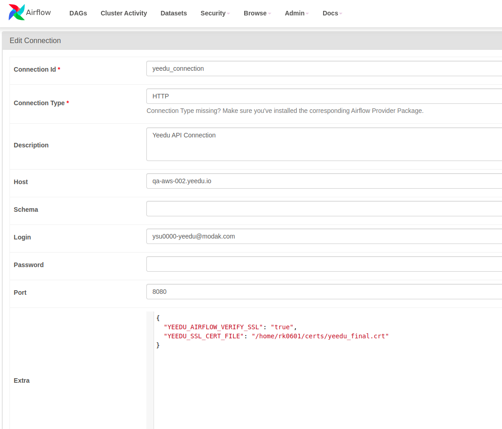
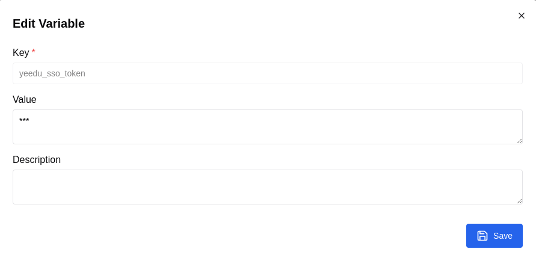

# Airflow Yeedu Operator

[](https://badge.fury.io/py/airflow-yeedu-operator)

> **Note:** This version of `airflow-yeedu-operator` is compatible only with **Apache Airflow 3.x**. Apache Airflow 2.x is **no longer supported**.

---

## Installation

To install the Yeedu Operator in your Airflow environment, run:

```bash
pip3 install airflow-yeedu-operator
```

---

## Overview

The `YeeduOperator` enables Apache Airflow users to easily submit and monitor Spark jobs and notebooks in the **Yeedu** platform. This operator acts as a bridge between Airflow workflows and Yeedu's computing capabilities.

### Key Features

- Submit both notebooks and Spark jobs to Yeedu from your Airflow DAGs
- Monitor job progress and completion status in real-time
- Automatically capture and display logs in Airflow UI for easy troubleshooting
- Support for multiple authentication methods (LDAP, AAD, SSO)

---

## Prerequisites

- Apache Airflow 3.x environment
- Valid credentials to interact with the Yeedu API.
- Yeedu Authentication (LDAP, AAD, or SSO)
- Valid certificate for SSL if applicable

---

## Airflow Connection Setup

### Step 1: Create Airflow Connection

1. In the Airflow UI, go to **Admin > Connections**
2. Click the **+ Add Connection** button to create a new connection

Fill in the following fields:

| Field     | Value / Example                        |
| --------- | -------------------------------------- |
| Conn Id   | `yeedu_connection`                     |
| Conn Type | `HTTP`                                 |
| Login     | Your LDAP/AAD username (if applicable) |
| Password  | Your password (if applicable)          |
| Extra     | JSON with SSL options (see below)      |

### Extra JSON Field

```json
{
  "YEEDU_AIRFLOW_VERIFY_SSL": "true",
  "YEEDU_SSL_CERT_FILE": "/path/to/cert/file"
}
```

> Replace `/path/to/cert/file` with the actual path to your certificate file.

---

## SSO Token Setup (Only for SSO auth)

If your Yeedu authentication method is **SSO**, follow these steps:

1. Go to **Admin > Variables**
2. Click **+ Add Variable**
3. Enter:
   - **Key**: e.g., `yeedu_sso_token`
   - **Value**: your Yeedu login token

You will refer to this variable in your DAG using `token_variable_name`.

---

## Example DAG

### DAG Definition

```python
from datetime import datetime, timedelta
from airflow import DAG
from yeedu.operators.yeedu import YeeduOperator

default_args = {
    'owner': 'airflow',
    'depends_on_past': False,
    'start_date': datetime(2023, 1, 1),
    'retries': 1,
    'retry_delay': timedelta(minutes=5),
}

dag = DAG(
    'yeedu_job_execution',
    default_args=default_args,
    description='DAG to execute jobs using Yeedu API',
    schedule_interval='@once',
    catchup=False,
)
```

---

## Task Configuration

### Authentication Options

The Yeedu Operator supports two authentication methods:

#### Option 1: LDAP / AAD Authentication

For LDAP or Azure Active Directory authentication, provide your credentials in the Airflow connection:

```python
submit_job_task = YeeduOperator(
    task_id='ldap_task',
    job_url='https://hostname:{restapi_port}/tenant/tenant_id/workspace/workspace_id/spark/notebook/notebook_id',
    connection_id='yeedu_connection',
    dag=dag,
)
```

> **Tip:** Copy the Job/Notebook URL directly from the Yeedu UI. Make sure to replace the port in the URL with your actual `restapi_port` value.

---

#### Option 2: SSO Authentication

For Single Sign-On authentication, use a token stored in Airflow Variables:

```python
submit_job_task = YeeduOperator(
    task_id='sso_task',
    job_url='https://hostname:{restapi_port}/tenant/tenant_id/workspace/workspace_id/spark/notebook/notebook_id',
    connection_id='yeedu_connection',
    token_variable_name='yeedu_sso_token',  # Reference to your Airflow Variable
    dag=dag,
)
```

> **Important:** When using SSO authentication, do not set `Login` and `Password` fields in the Airflow connection.

---

## Quick Start Guide

Follow these steps to get your Yeedu jobs running in Airflow:

1. **Install the package**: `pip3 install airflow-yeedu-operator`
2. **Configure authentication**: Set up either the connection (for LDAP/AAD) or the token variable (for SSO)
3. **Create your DAG file**: Copy the example code from above and modify it for your specific use case
4. **Deploy your DAG**: Place the DAG file in your Airflow DAGs folder or use the Airflow UI Code Editor
5. **Verify configuration**: Ensure connections and variables are properly set
6. **Run your DAG**: Trigger manually or let it run on schedule
7. **Monitor execution**: Track progress in both Airflow UI and Yeedu UI

> **Troubleshooting Tip**: If you encounter connection issues, verify your SSL settings and credentials first.

---

## Advanced Configuration

The `YeeduOperator` supports additional parameters for more complex use cases:

### Optional Parameters

| Parameter    | Description                                              | Example                                                       |
| ------------ | -------------------------------------------------------- | ------------------------------------------------------------- |
| `arguments`  | Arguments to pass to the job run                         | `arguments="--input /data/input.csv --output /data/output"`   |
| `conf`       | Configuration list for Spark job runs (key=value format) | `conf=["spark.driver.memory=4g", "spark.executor.memory=8g"]` |
| `cluster_ids` | Fallback cluster IDs if the current notebook execution fails due to any reason (eg. OOM). | `cluster_ids=[1,2,3]` |

### Example with Advanced Configuration

```python
# Example with Spark configuration
spark_job_task = YeeduOperator(
    task_id='spark_job_with_config',
    job_url='https://hostname:{restapi_port}/tenant/tenant_id/workspace/workspace_id/spark/job/job_id',
    connection_id='yeedu_connection',
    # Pass arguments to the job
    arguments="--date {{ ds }}",
    # Set Spark configuration
    conf=[
        "spark.driver.memory=4g",
        "spark.executor.memory=8g",
        "spark.executor.instances=2"
    ],
    cluster_ids=[1,2,3],
    dag=dag,
)
```


### Looping / Dynamic Task Mapping

The `YeeduOperator` also supports looping over inputs using **dynamic task mapping** in Airflow. This is useful when you want to run the same notebook or job multiple times with different inputs.

### Example: Iterating Over Inputs

```python
workflow_notebook = YeeduOperator.partial(
    task_id='workflow_notebook_iteration',
    job_url='https://hostname:{restapi_port}/tenant/tenant_id/workspace/workspace_id/notebook/notebook_id',
    connection_id='yeedu_connection',
    max_active_tis_per_dag=1,
    dag=dag,
    trigger_rule=TriggerRule.ALL_SUCCESS
).expand(
    loop_input=['1', '2', '3', '4', '5']  # List of values to loop over
)
```

### Explanation

* `YeeduOperator.partial(...)`: Creates a template for the task.
* `.expand(loop_input=[...])`: Dynamically generates multiple task instances with different `loop_input` values.
* `max_active_tis_per_dag (optional)`: If you want to limit parallelism, set this parameter (e.g., max_active_tis_per_dag=2 to allow only 2 iterations at once).

---

## Email Notifications

The package includes an `EmailNotificationHook` that enables sending styled email notifications about DAG and task statuses via Microsoft Graph API. This is useful for alerting stakeholders about job completions or failures.

### Setup Email Notifications

1. Set up the following Airflow variables:

   - `AIRFLOW_VAR_TENANT_ID`: Your Microsoft Azure tenant ID
   - `AIRFLOW_VAR_CLIENT_ID`: Your Microsoft application client ID
   - `AIRFLOW_VAR_CLIENT_SECRET`: Your Microsoft application client secret
   - `AIRFLOW_VAR_SENDER_EMAIL`: Email address that will send notifications

2. Use the hook in your DAG:

```python
from yeedu.hooks.email_notification import EmailNotificationHook

def success_callback(context):
    email_hook = EmailNotificationHook()
    email_hook.notify_dag(
        recipients=["recipient@example.com"],
        dag_id=context['dag'].dag_id,
        run_id=context['run_id'],
        status="success"
    )

def failure_callback(context):
    email_hook = EmailNotificationHook()
    email_hook.notify_task(
        recipients=["recipient@example.com"],
        task_id=context['task_instance'].task_id,
        run_id=context['run_id'],
        status="failed"
    )

# Add callbacks to your DAG
dag = DAG(
    'yeedu_job_execution',
    default_args=default_args,
    on_success_callback=success_callback,
    on_failure_callback=failure_callback,
    # other DAG parameters
)
```

> **Note:** The email notifications include professionally styled HTML templates with color-coded status indicators.

---

## Visual References

### Connection Configuration Example



### SSO Token Variable Example



---
